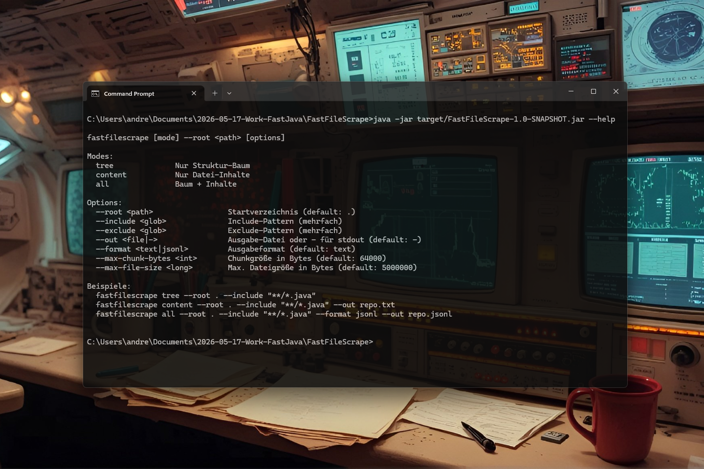

# FastFileScrape v0.1.0 [ALPHA] — Ultra‑Fast File Tree & Content Scraper for Java

[](https://github.com/andrestubbe/FastFileScrape/releases/tag/v0.1.0)
[](https://opensource.org/licenses/MIT)
[](https://www.java.com)
[]()
[](https://jitpack.io/#andrestubbe/FastFileScrape)

**⚡ Scrape and process millions of files in milliseconds with zero latency.**

FastFileScrape is the high‑speed file scraping module of the FastJava ecosystem.  
It provides two core capabilities:

- **FastFileTree** — build complete directory trees with include/exclude rules
- **FastFileScrapeContent** — extract file contents with chunking for LLMs and agents

[](https://youtu.be/3yPRjiXqpaY)

---

## Table of Contents

- [Key Features](#key-features)
- [Quick Start](#quick-start)
- [Installation](#installation)
- [Demo (Java)](#demo-java)
- [API Reference](#api-reference)
- [Roadmap](#roadmap)
- [License](#license)

---

## Key Features

### 🟩 FastFileTree — Directory Structure Engine

- Recursive directory walking
- Include/Exclude glob filters
- Sorted output (folders → files)
- JSON or ASCII tree output
- Git‑ignore aware (optional)

### 🟧 FastFileScrapeContent — File Content Engine

- Extracts file contents with UTF‑8 safety
- Chunking by byte size or newline boundaries
- Include/Exclude patterns
- JSONL or plain text output
- Ideal for LLM context ingestion

### 🟦 CLI Tool — `fastfilescrape`

- `tree` → structure only
- `content` → file contents only
- `all` → both combined
- Output to stdout or file
- JSONL mode for AI pipelines

---

## Quick Start

```pash
# Show directory tree
fastfilescrape tree --root . --include "**/*.java"

# Extract file contents
fastfilescrape content --root . --include "**/*.java" --out repo.txt

# Tree + Content in JSONL
fastfilescrape all --root . --include "**/*.java" --format jsonl --out repo.jsonl
```

---

## Demo (Java)

```java
import fastfilescrape.*;

public class Demo {
    public static void main(String[] args) throws Exception {

        // Tree
        var tcfg = new FastFileTree.Config();
        tcfg.root = Path.of(".");
        var tree = FastFileTree.build(tcfg);
        FastFileTree.printTree(tree, System.out);

        // Content
        var ccfg = new FastFileScrapeContent.Config();
        ccfg.root = Path.of(".");
        ccfg.includeGlobs = List.of("**/*.java");

        FastFileScrapeContent.scrape(ccfg, (file, chunk, text) -> {
            System.out.println("=== " + file + " (chunk " + chunk + ") ===");
            System.out.println(text);
        });
    }
}
```

---

## Installation

### Option 1: Maven (Recommended)

Add the JitPack repository and the dependencies to your `pom.xml`:

```xml

<repositories>
    <repository>
        <id>jitpack.io</id>
        <url>https://jitpack.io</url>
    </repository>
</repositories>
<dependencies>
    <dependency>
        <groupId>com.github.andrestubbe</groupId>
        <artifactId>FastFileScrape</artifactId>
        <version>v0.1.0</version>
    </dependency>
    <dependency>
        <groupId>com.github.andrestubbe</groupId>
        <artifactId>FastGLOB</artifactId>
        <version>v0.1.0</version>
    </dependency>
    <dependency>
        <groupId>com.github.andrestubbe</groupId>
        <artifactId>FastCore</artifactId>
        <version>v1.0.0</version>
    </dependency>
</dependencies>
```

### Option 2: Gradle (via JitPack)

```groovy
repositories {
    maven { url 'https://jitpack.io' }
}
dependencies {
    implementation 'com.github.andrestubbe:FastFileScrape:v0.1.0'
    implementation 'com.github.andrestubbe:FastGLOB:v0.1.0'
    implementation 'com.github.andrestubbe:FastCore:v1.0.0'
}
```

### Option 3: Direct Download (No Build Tool)

Download the pre-compiled JARs to add them to your classpath:

1. 📦 [**FastFileScrape-v0.1.0.jar**](https://github.com/andrestubbe/FastFileScrape/releases) (The Scraper Core Library)
2. 📦 [**FastGlob-v0.1.0.jar**](https://github.com/andrestubbe/FastGLOB/releases) (The Native Glob Matching Library)
3. ⚙️ [**fastcore-v1.0.0.jar**](https://github.com/andrestubbe/FastCore/releases) (The Mandatory JNI Loader)

> [!IMPORTANT]
> Since FastFileScrape is natively accelerated, all three JARs must be present in your classpath for the JNI-accelerated directory walking to operate correctly on Windows.

---

## API Reference

### FastFileTree

| Method                        | Description               |
|-------------------------------|---------------------------|
| `Node build(Config cfg)`      | Builds the directory tree |
| `printTree(Node, Appendable)` | Prints ASCII tree         |

### FastFileScrapeContent

| Method                          | Description                  |
|---------------------------------|------------------------------|
| `scrape(Config cfg, Sink sink)` | Reads files and emits chunks |

---

## Documentation

* **[COMPILE.md](COMPILE.md)**: Full compilation guide (MSVC C++17 build chain + JNI Setup).
* **[REFERENCE.md](REFERENCE.md)**: Full API descriptions, border configurations, and codepoint index.
* **[PHILOSOPHIE.md](PHILOSOPHIE.md)**: The engineering rationale for zero-allocation performance.
* **[ROADMAP.md](ROADMAP.md)**: Future milestones and planned features.

---

## Platform Support

| Platform      | Status            |
|---------------|-------------------|
| Windows 10/11 | ✅ Fully Supported |
| Linux         | 🚧 Planned        |
| macOS         | 🚧 Planned        |

---

## License

MIT License — See [LICENSE](LICENSE) file for details.

---

## Related Projects

- [FastFileIndex](https://github.com/andrestubbe/FastFileIndex) — Ultra-fast filesystem scanner
- [FastFileContentIndex](https://github.com/andrestubbe/FastFileContentIndex) — High-speed in-file text indexing
- [FastFileWatch](https://github.com/andrestubbe/FastFileWatch) — High-performance directory watch service using USN Journal
- [FastFileSearch](https://github.com/andrestubbe/FastFileSearch) — Ultra-fast indexed file prefix trie search
- [FastGLOB](https://github.com/andrestubbe/FastGLOB) — Ultra-fast native Win32 glob matching and traversal
- [FastFileSystem](https://github.com/andrestubbe/FastFileSystem) — Unified filesystem operations (Index, Search, Watch, Scrape) in one API

---

**Part of the FastJava Ecosystem** — *Making the JVM faster. Small package. Maximum speed. Zero bloat. 🚀📋*
